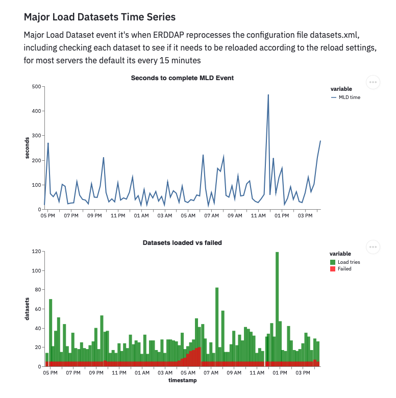

# ERDDAP Status.html page dashboard

This Streamlit app, uses [erddap-python](https://github.com/hmedrano/erddap-python) library to collect metrics from public ERDDAP Servers, and uses various plotting libraries to create an interactive dashboard.

[ERDDAP](https://coastwatch.pfeg.noaa.gov/erddap/information.html) it's a data distribution server that gives you a simple, consistent way to download subsets of scientific datasets in common file formats and make graphs and maps.

Access the web application [here](https://share.streamlit.io/hmedrano/erddap-status-dashboard/main/dashboard_streamlit_app.py)

-----
